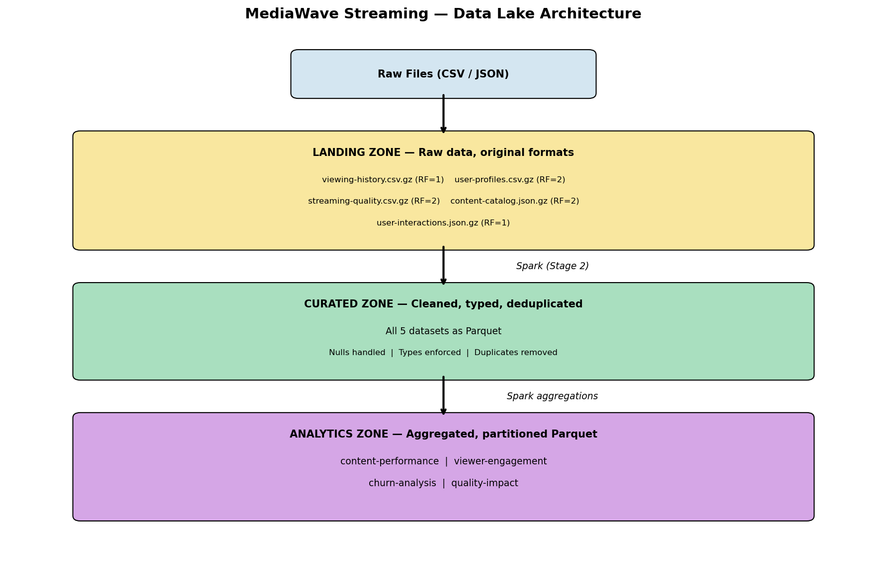

# MediaWave Streaming — Big Data Pipeline

**ISM 6562 · Final Project · Team: Data Avengers**

A complete big data pipeline (HDFS · Spark · Kafka · Airflow) for MediaWave Streaming, a fictional video streaming company facing content recommendation and viewer engagement challenges.

Repository: https://github.com/qua-ng/ism4545-data-avengers

---

## Team Members

| Name | Role | GitHub |
|------|------|--------|
| Juan | Integration Lead + HDFS (Stage 1) | @___ |
| Yusuke | Spark Batch (Stage 2) | @___ |
| Quang | Kafka + Streaming (Stage 3) | @qua-ng |
| Alex | Airflow + Data Quality (Stage 4) | @___ |
| Helen Nguyen | Project Management + Report + Presentation | @helennganguyen |

---

## Project Scenario

_TODO: 2-3 paragraphs summarizing MediaWave business problem (content recommendation + viewer engagement), the datasets we work with, and the 5-7 questions we answer. Helen fills this in after Day 2._

---

## Architecture Overview

The pipeline implements four layers, processing MediaWave streaming data from raw landing through curated analytics:

1. **Store** - HDFS data lake with landing / curated / analytics zones
2. **Transform** - PySpark batch jobs for cleaning, joins, and aggregations
3. **Stream** - Kafka + Spark Structured Streaming for real-time viewing events
4. **Orchestrate** - Airflow DAGs with quality gates, retries, and monitoring



---

## Setup Instructions

A grader should be able to clone this repo, run `docker compose up -d`, and reproduce the full pipeline.

### Prerequisites

- Docker Desktop (>= 20.10) with **at least 8 GB RAM allocated**
- Git
- ~10 GB free disk space
- (Apple Silicon users: Rosetta 2 enabled - `platform: linux/amd64` is set on all services)

### Step 1 - Clone the repo
```
git clone https://github.com/qua-ng/ism4545-data-avengers.git
cd ism4545-data-avengers/"Final Project"
```

### Step 2 - Download the MediaWave datasets

Datasets are hosted in the course data repository (~150 MB total, not committed here). See `data/README.md` for full instructions.

### Step 3 - Boot the full stack
```
docker compose up -d
```

Wait ~3 minutes for all services to become healthy. Then verify:

| Service | URL | Login |
|---------|-----|-------|
| HDFS NameNode | http://localhost:9870 | - |
| Spark Master | http://localhost:8083 | - |
| Airflow | http://localhost:8080 | admin / admin |
| Kafka UI | http://localhost:8088 | - |
| Jupyter | http://localhost:8888?token=spark | token: spark |

### Step 4 - Run the batch pipeline

_TODO: Alex fills in Airflow DAG trigger commands._

### Step 5 - Run the streaming pipeline

_TODO: Quang fills in producer + consumer commands._

---

## Data Sources

All datasets are pre-generated and hosted in the course data repository:
https://github.com/prof-tcsmith/ism6562s26-class/tree/main/final-projects/data/10-mediawave-streaming/

| File | Description | Format |
|------|-------------|--------|
| user-profiles.csv.gz | Subscriber demographics, signup, subscription tier | CSV |
| viewing-history.csv.gz | Per-session viewing events with completion % | CSV |
| content-catalog.json.gz | Title metadata: genre, cast, runtime, release year | JSON |
| user-interactions.json.gz | Ratings, likes, searches, clicks | JSON |
| streaming-quality.csv.gz | Buffering, bitrate, resolution, device | CSV |

See `data/README.md` for download instructions.

---

## Repository Structure
```
Final Project/
├── docker-compose.yml          # Full infrastructure (HDFS, Spark, Kafka, Airflow, Jupyter)
├── docker/                     # Custom Dockerfiles (Spark, Airflow)
├── data/                       # Dataset download instructions
├── docs/                       # Architecture diagram + per-stage design notes
├── notebooks/                  # Jupyter notebooks (one per pipeline stage)
├── src/
│   ├── common/                 # Shared schemas, paths, quality functions
│   ├── ingest/                 # HDFS load scripts (Stage 1)
│   ├── transforms/             # Spark cleaning, joins, aggregations (Stage 2)
│   └── streaming/              # Structured Streaming consumer (Stage 3)
├── producers/                  # Kafka event producer (Stage 3)
├── dags/                       # Airflow DAGs (Stage 4)
├── report/                     # Final written report (PDF + source)
└── presentation/               # Slide deck + screenshots
```

---

## Memory Configuration

The full stack targets ~8 GB RAM for all services combined.

| Layer | Services | RAM |
|-------|----------|-----|
| HDFS | namenode + 2 datanodes | ~1.5 GB |
| Spark | master + worker | ~3 GB |
| Kafka | zookeeper + broker + UI | ~1.5 GB |
| Airflow | postgres + webserver + scheduler | ~1.5 GB |
| Jupyter | notebook server | ~2 GB |

For 8 GB machines, see "Lightweight Mode" below.

### Lightweight Mode (8 GB machines)

_TODO: Add lightweight profile commands once configured. Juan._

---

## Key Findings

_TODO: Top 3 business insights for MediaWave. Helen fills in after Day 5._

1. _Finding 1_
2. _Finding 2_
3. _Finding 3_

---

## Acknowledgments

Built for ISM 6562 (Big Data for Business Applications), Spring 2026, Dr. Tim Smith. Pipeline architecture follows the four-layer pattern covered in Weeks 8-11.

